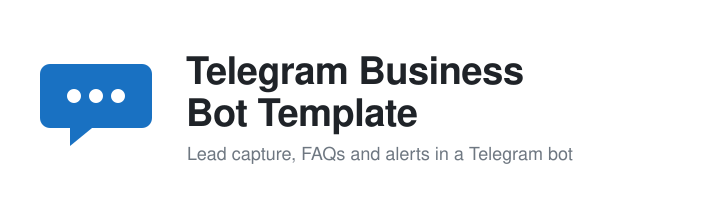

<h1>
  <picture>
    <source media="(prefers-color-scheme: dark)" srcset="assets/logo-dark.svg">
    
  </picture>
</h1>

[](https://github.com/emirhuseynrmx/telegram-business-bot/actions)
[](https://www.python.org/)

Telegram bot template for lead capture, FAQs, alerts, and small-business automation.

Built for practical business workflows: collect leads, answer common questions, provide order/status replies, and give admins a clean export path.

## Features

- `/start` onboarding message
- `/lead name | email | message` lead capture
- `/faq pricing` style FAQ answers
- `/status ORDER_ID` order/status response stub
- `/export_leads` admin-only lead export
- CSV lead storage for simple handoff
- Pydantic validation for names, email addresses, and message length
- export summary with latest lead timestamp
- `.env.example` for deployment settings
- tested service layer with no Telegram network calls

## Demo

```bash
pip install -e ".[dev]"
cp .env.example .env
business-bot
```

## Example Lead Command

```text
/lead Alice Johnson | alice@example.com | I need a quote for weekly reports
```

## Sample Delivery Report


## Run Tests

```bash
ruff check .
pytest
```

## Scope

This template uses user-owned bot credentials and normal Telegram Bot API behavior. It does not automate spam, scraping, or unsolicited outreach.
